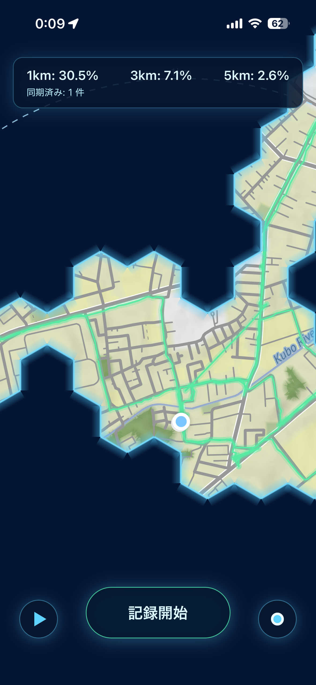
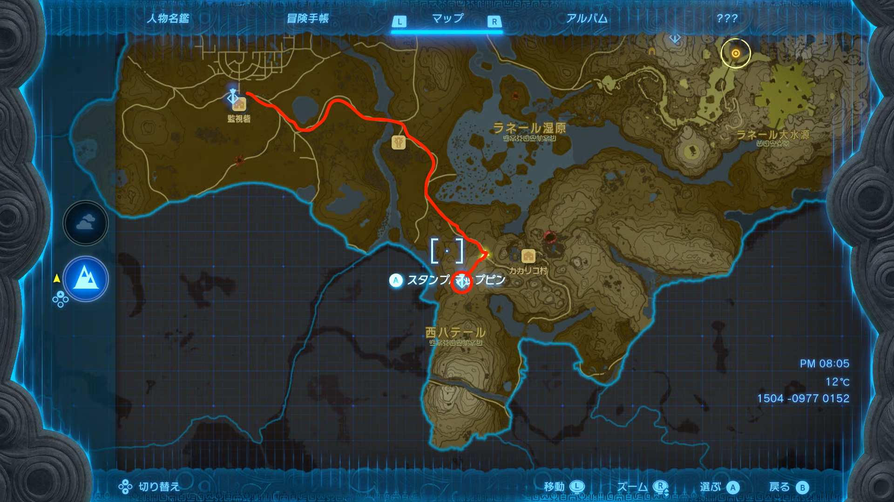

# Nurie ~暗い地図を歩いて明るくしよう ~

2026/5/29 平野大介

---

<div class="columns">
<div class="photo-column">



</div>
<div>

## iOSアプリ

- GPSで位置情報を取得して歩いた経路を記録
- 初期状態では地図が隠されていて、通った道の周辺を明るくする
- 1,3,5kmの半径の中の六角形のパネルのうち、どのくらい明るくなったのか表示
- 経路を再生できる

## webアプリ

- 閲覧専用

</div>
</div>

---

# 作ったきっかけ

## 家の周りを探索する体験

- 最近散歩をしていて、家の周りにも意外と知らない道が多いことに気がついた
- 歩いた場所が少しずつ明るくなることで、散歩を探索のように楽しめる体験にしたかった

## 参考にした体験

- ゼルダの伝説 ティアーズ オブ ザ キングダムのようなオープンワールドRPGのマップ
- 最初はマップが隠されていて、冒険を進めると少しずつ解放されていく
- 経路をあとから再生できることで、自分の移動を振り返れる

---

# ティアーズオブザキングダムのマップ

<div class="full-image">



<div class="image-source">

https://gamewith.jp/zelda-totk/article/show/397749

</div>

</div>

---

# バックグラウンドで位置情報を取得する

- React Native では、アプリの画面が閉じている間も普通の JavaScript が動き続けるわけではない
- そこで Expo の位置情報 API に「この名前のタスクを、位置が変わったら呼んでください」と登録する
- `TaskManager.defineTask` は、OS から位置情報が届いたときに実行される処理を登録する関数
- `Location.startLocationUpdatesAsync` は、登録済みタスクを使って位置情報の更新を開始する関数
- 実装では「最高精度」「徒歩向け」「約10m移動ごと」「iOSの記録中表示あり」という設定にしている
- OS から届いた複数の位置情報を順に見て、緯度・経度・時刻を記録する

---

# 位置情報を受け取るタスクを登録する

```ts
import * as Location from "expo-location";
import * as TaskManager from "expo-task-manager";

const TASK_NAME = "nurie-location-tracking";

// OS から位置情報が届いたときに呼ばれる処理
TaskManager.defineTask(TASK_NAME, async ({ data }) => {
  for (const loc of data.locations) {
    await insertPoint({
      lat: loc.coords.latitude,
      lng: loc.coords.longitude,
      recordedAt: loc.timestamp,
    });
  }
});
```

---

# 位置情報の更新を開始する

```ts
import * as Location from "expo-location";
import { useEffect } from "react";

useEffect(() => {
  const startIfEnabled = async () => {
    // 画面表示後に、保存済みの記録ON/OFF状態を確認する
    const enabled = await getTrackingEnabled();
    if (!enabled) return;

    await Location.startLocationUpdatesAsync(TASK_NAME, {
      accuracy: Location.Accuracy.Highest,
      activityType: Location.ActivityType.Fitness,
      distanceInterval: 10,
      showsBackgroundLocationIndicator: true,
    });
  };

  void startIfEnabled();
}, []);
```

---

# iOS の位置情報権限

- iOS では、位置情報の許可には大きく2種類ある
- `requestForegroundPermissionsAsync` は「アプリを開いている間だけ使う」許可を求める
- `requestBackgroundPermissionsAsync` は「アプリを閉じていても使う」許可を求める
- バックグラウンドで散歩の経路を記録するには、background の許可が必要になる
- 設定画面では「このAppの使用中」ではなく「常に」を選んでもらう必要がある
- そのため、このアプリでは起動時に foreground を確認し、その後 background の許可も求めている

---

# MapLibre で地図に独自表示を重ねる

- 地図データは Stadia Maps の Stamen Terrain を使っている
- 地図を描画するライブラリは、iOS が MapLibre Native、Web が MapLibre GL JS
- 背景地図の上に、アプリ独自の図形を重ねて表示できる
- 表示したいデータは `source` として渡し、その見た目は `layer` で指定する
- source の例: `tracks` は歩いた経路、`fog-hidden` は暗い hex、`radius-bands` は1/3/5kmの円
- layer の例: `tracks` は線、`fog-hidden` は塗りつぶし、`playback-marker` は丸い点として描く
- layer の色、線の太さ、透明度、表示順を変えることで、ゲームっぽい見た目を作っている

---

# 経路データを GeoJSON にする

```ts
// trackData: 歩いた経路を表す GeoJSON
const trackData = {
  type: "FeatureCollection",
  features: [
    {
      geometry: {
        type: "LineString",
        coordinates: [
          [139.7, 35.6],
          [139.71, 35.61],
        ],
      },
    },
  ],
};
```

---

# MapLibre で背景地図と経路を描く

```tsx
// Stadia Maps の Stamen Terrain を背景地図として使う
const mapStyle = `https://tiles.stadiamaps.com/styles/stamen_terrain.json`;

<MapLibreMap mapStyle={mapStyle}>
  {/* source: 歩いた経路の GeoJSON データ */}
  <GeoJSONSource id="tracks" data={trackData}>
    {/* layer: source を線として描く設定 */}
    <Layer
      id="tracks"
      type="line"
      source="tracks"
      paint={{
        "line-color": "#58EAA3",
        "line-width": 2,
      }}
    />
  </GeoJSONSource>
</MapLibreMap>;
```

---

# nativeとwebの切り替え

- iOS と Web では、地図ライブラリも位置情報の扱いも違う
- 実装を切り替える方法はいくつかある
  - `Platform.OS === 'web'` のように、コードの中で if 文を書く
  - `Map.native.tsx` / `Map.web.tsx` のように、ファイル名で分ける
- 今回はファイル名で分ける方針にした
- `Map` を import すると、iOS では `Map.native.tsx`、Web では `Map.web.tsx` が選ばれる
- 画面側は `Platform.OS` を直接見なくてよくなる
- 理由は、地図やGPSのように iOS と Web の実装差分が大きい部分を、同じファイルに混ぜたくなかったため

---

# nativeとwebのディレクトリ構成

- ディレクトリ構成にもいくつか方針がある
  - root 付近に `native/`、`web/`、`common/` を作る
  - 同じ feature の中に `.native.tsx`、`.web.tsx`、共通ファイルを隣に並べる
- 今回は、同じ feature の中に隣に並べる方針にした
  - 例: `Map.native.tsx`、`Map.web.tsx`、`Map.tsx`
- 理由は、同じ機能の iOS 実装と Web 実装を近くに置いた方が、差分を見比べやすいため
- root 付近で `native/` と `web/` に分けると、同じ機能のコードが離れてしまい、修正時に追いにくい

---

# ビルド方法

- Expo Go は、Expo が用意した汎用アプリの中で自分の JavaScript を動かす方法
- 自分のアプリとしてビルドする場合は、権限設定や native library を含んだ `nurie` 専用アプリを作る
- Expo Go: `pnpm start` を実行し、iPhone の Expo Go で QR コードを読む
- iOS 開発ビルド: `expo run:ios`
- iOS リリースビルド: `expo run:ios --configuration Release --device`
- 今回は、アプリを閉じている間の位置情報記録と MapLibre Native を確認するため、実機ビルドが必要
- 無料の個人 Apple ID で実機に入れた開発用アプリは、7日間で期限切れになる

---

# 落とした仕様

- 計測開始ボタンは用意せず、常に位置情報を記録し続ける。
  - 計測し忘れを防げるのでいいと思ったが、スマホの通信量と充電がもったいないと思って却下

- 道データを表示して、どの道を通ったのかを記録 + 通った道の割合の表示
  - GPSに数メートルの誤差があるので、通ったはずの道が記録されないことがあった。
  - 道だと全然割合が増えず、モチベが下がるので却下。

---

# 感想

- 開発期間が長め + 自分がユーザーだったため、仕様やデザインを自分好みに改善していくことができた。
- 位置情報取得機能が、web開発に比べると少し IoT 感があって新鮮だった。
- 「位置情報取得していいですか？」の権限依頼の実装の仕方をしれたのは良かった。そんなに難しくなかった。
- スマホアプリのリリースは大変そうなのでやっていない。そういう点で、webアプリはリリースが楽でいいなと思った。
